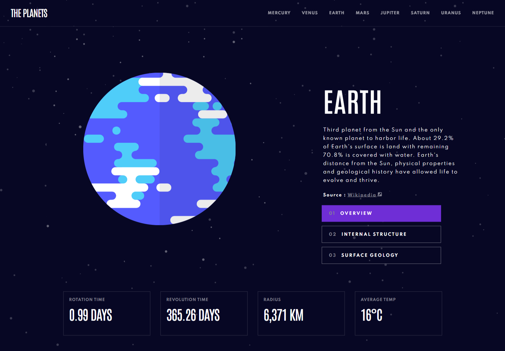

# Planets Facts

## Table of contents

- [Overview](#overview)
  - [The challenge](#the-challenge)
  - [Screenshot](#screenshot)
  - [Links](#links)
- [My process](#my-process)
  - [Built with](#built-with)
  - [What I learned](#what-i-learned)
  - [Continued development](#continued-development)
- [Author](#author)

## Overview

### The challenge

Users should be able to:

- View the optimal layout for the app depending on their device's screen size
- See hover states for all interactive elements on the page
- View each planet page and toggle between "Overview", "Internal Structure", and "Surface Geology"

### Screenshot



### Links

- Live Site URL: [Planet Facts](https://planetfacts.vercel.app/)

## My process

### Built with

- Atomic Design Pattern
- Flexbox
- Mobile-first workflow
- [React](https://reactjs.org/) - JS library
- [Styled Components](https://styled-components.com/)

### What I learned

This website can be fairly easy or hard to build depending on the strategy you choose to go with. At first, I was attempting to use Redux to handle state changes on each individual planet page, but quickly realized a simple tab strategy would lessen the complexity of the build.

In this case, the data will remain relatively "fixed" without a need to plan for updates. There are only 8 planets, and 3 facts associated with each planet.

Each link and tab had its own individual color that needed to be associated by page. I created a new hook to handle this problem as seen here:

```js
import { useEffect, useState } from "react";

export const useMediaQuery = (query) => {
  const mediaMatch = window.matchMedia(query);
  const [matches, setMatches] = useState(mediaMatch.matches);

  useEffect(() => {
    const handler = (e) => setMatches(e.matches);
    mediaMatch.addEventListener("change", handler);
    return () => mediaMatch.removeEventListener("change", handler);
  });
  return matches;
};
```

For this part of the code, the size of the screen will dictate when a certain styling effect is shown to the user, which in this case is a tab with a bottom border or a li tag with a filled in background color.

```js
const styles = {
  container: (isScreenSize767) => ({
    backgroundColor: isScreenSize767
      ? `${handlePlanetColors(name)}`
      : "transparent",
    borderColor: isScreenSize767 ? `${handlePlanetColors(name)}` : "",
    borderBottom: isScreenSize767
      ? "none"
      : `5px solid ${handlePlanetColors(name)}`,
  }),
};
```

Overall, the main thing I gained from this is to have a clear idea of which strategy will lessen the complexity of your work. Choosing the right tool is essential.

### Continued development

I expect to encounter problems like this again, so it may be time to create a Storybook for some reusable components. As I become more experienced, I expect to come up with more efficient implementation strategies, but past work can help speed up my development.

## Author

- Website - [Jason Nembhard](https://www.jasonnembhard.com)
